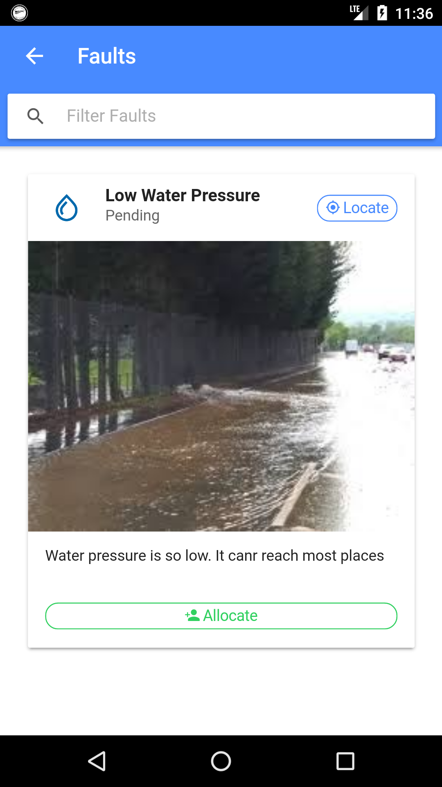

#ZINWA Fault Tracking System
Android App for reporting and tracking faults in the water reticulation system in Zimbabwe. App allows customers to report and track the status of faults reported. Also allows Maintenance Foremen to allocate faults to engineers.

#Objectives
ZINWA Fault Reporting and Tracking Android Application 
aims to attain the following objectives: 
1. To enable instant response as soon as piped water faults are reported on the application
2. To develop an application that will enable the maintenance foreman to allocate faults 
to engineers
3. To build an application that will allow the customer to track the fault so as to trace the 
fault status 
4. To create an application that will enable the engineer to update fault status after 
attending the fault
5. To alert the maintenance foreman on pending faults through a pop up notification 
6. To enhance customer relationship management through an open forum where people 
can comment or give suggestions and also to inform the general public on how to 
conserve water

## Screenshots

## Installations
### Prerequisites
1. PHP Server 7+
2. MySQL database server
3. NodeJS
4. Android SDKs

### Stages
1. npm i -g ionic
2. npm i -g cordova
3. Open project folder via console and run
npm i
4. extract the server_side_api.zip and add to web root
5. create database named hackathorn and import hackathon.sql
6. in project path run
ionic serve
7. when the login screen appears, slide from left to right and configure server ip e.g http://localhost/zinwa/
